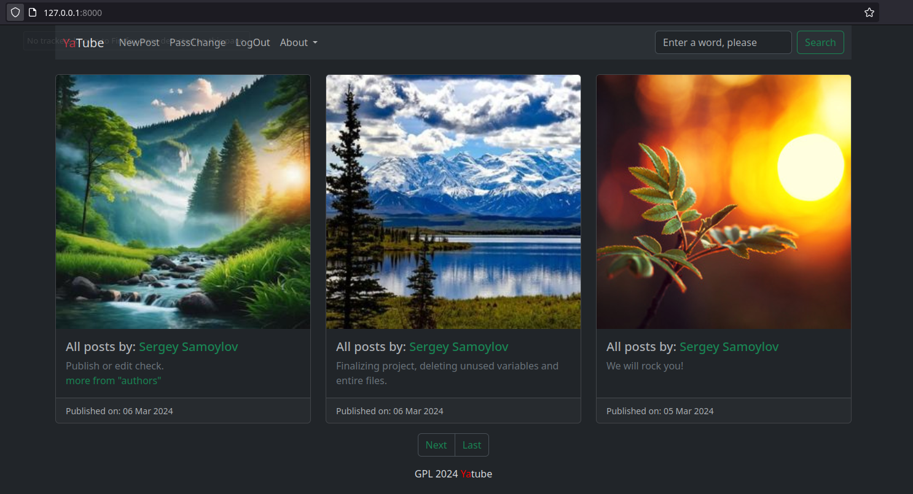
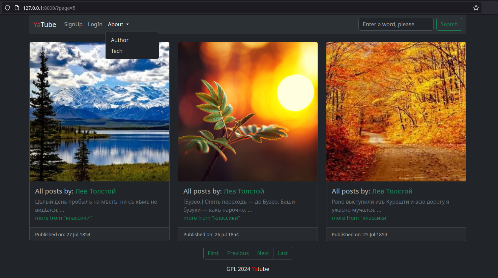
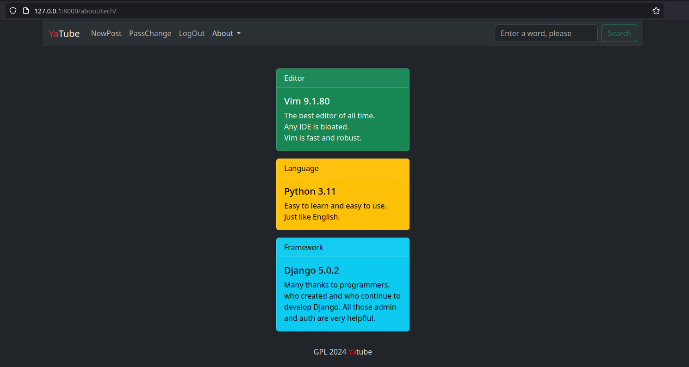

# YATUBE PROJECT 2.0 (SPRINT 4)

### Description
This is a Yandex.Practicum Yatube learning project.

(added several tweaks, hid sensetive line in settings and spiced it up with the dark theme)

Made with latest Django 5.0.2 and Python 3.11.7

### Launch in Dev mode
- git clone this repo
- activate virtual environment
- install packages from requirements.txt
- and run the server from **YaTube_spring_4/yatube** directory
- oh, and by the way, you'll need .env file with your SECRET_KEY from
  settings.py :-)

### It will look like this

### And few more little things:
- changed max posts per page from 10 to 3 (who reads 10 posts one by one anyways?)
- switched back to English
- added random images for a post (hey, it's XXI century!)
- added navigation and links in posts - each text is a link
- trancated words in listed posts, if post is of interest it should be read in full on its own page

### Author
Sergey Samoylov
